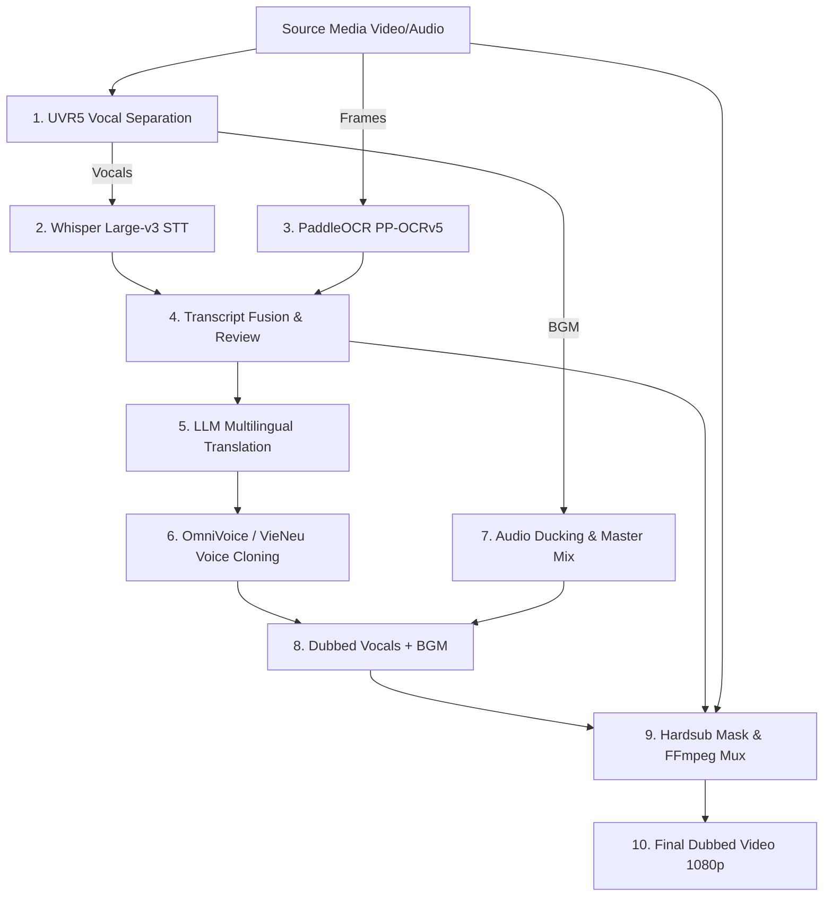

# Voice AI & Neural Dubbing Pipeline Engineering Skill

This skill governs the orchestration, tuning, and deployment of neural speech pipelines for automatic video dubbing, voice cloning, and multilingual localization.

---

## 1. Pipeline Architecture (10-Step Workflow)

---

## 2. Key Components & Tuning Standards

### 2.1 Whisper STT & PP-OCR Fusion
- **Whisper Large-v3**: Run on GPU with FP16, beam size 5, temperature fallback `[0.0, 0.2, 0.4]`.
- **PP-OCRv5**: Run on lower 20% ROI bounding box to capture hardcoded on-screen captions.
- **Fusion Logic**: Merge STT phoneme timestamps with OCR character recognition to eliminate hallucinations and homophone errors.

### 2.2 Neural Voice Cloning (OmniVoice / VieNeu-TTS)
- **Reference Audio Extraction**: Extract clean 5s - 15s reference voice slice with UVR5 background cancellation.
- **Zero-Shot Speaker Conditioning**: Normalize speaker embeddings ($L_2$ norm), maintain speaker gender and vocal timbre across long-form video dialogue.
- **Cross-Lingual Synthesis**: Generate native Vietnamese pronunciation preserving original speaker emotional inflections.
