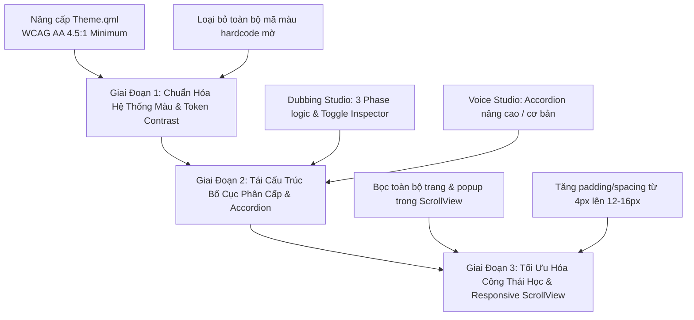

# Báo Cáo Kiểm Tra Toàn Diện & Phương Án Khắc Phục Lỗi Giao Diện GUI (LA-Studio / KOVA-DUB)

> **Mục tiêu:** Kiểm toán chi tiết toàn bộ các trang (Tabs), phân vùng (Panes), góc hiển thị và linh kiện (Components) trong mã nguồn QML của `LA-Studio`.
> **Vấn đề cốt lõi:**
> 1. **Lỗi màu sắc & Độ tương phản:** Chữ bị chìm, màu chữ trùng hoặc gần bằng màu nền (Low Contrast / Inverted Text), khó đọc nhãn và trạng thái.
> 2. **Lỗi bố cục & Nhồi nhét chi tiết:** Quá nhiều nút bấm, thanh trượt, metrics và panel bị dồn nén trên cùng một khung nhìn, gây chèn chúc, đè chữ, tràn khung khi co giãn cửa sổ.

---

## 🧭 MỤC LỤC CÁC TRANG ĐƯỢC KIỂM TOÁN
1. [Thành phần toàn cục: Thanh điều hướng (Sidebar), TitleBar & Log Panel](#1-thành-phần-toàn-cục)
2. [Tab 1: Dubbing Studio (`DubbingPage.qml` & 21 Sub-components)](#2-tab-dubbing-studio)
3. [Tab 2: Subtitle OCR (`SubtitleOcrPage.qml`)](#3-tab-subtitle-ocr)
4. [Tab 3: Voice Studio / TTS & Voice Cloning (`TtsPage.qml`, `VoiceCloningPage.qml`)](#4-tab-voice-studio-tts--cloning)
5. [Tab 4: Kho Mô Hình & Tải Xuống (`ModelsPage.qml`, `MyModelsPage.qml`, `MediaDownloadPage.qml`)](#5-tab-kho-mô-hình--tải-xuống)
6. [Tab 5: Cài Đặt & Developer Tools (`SettingsPage.qml`, `DeveloperPage.qml`)](#6-tab-cài-đặt--developer-tools)
7. [Các Hộp Thoại Popup / Dialogs Cố Định](#7-các-hộp-thoại-popup--dialogs)
8. [Bảng Tổng Hợp Phương Án & Lộ Trình Sửa Lỗi (Actionable Fix Plan)](#8-lộ-trình-khắc-phục-tổng-thể)

---

## 1. THÀNH PHẦN TOÀN CỤC (GLOBAL SHELL)

### 🔴 Lỗi 1.1: Thanh Menu Trái (Sidebar) — Nhãn & Icon Không Đủ Tương Phản
* **Vị trí:** Cột điều hướng bên trái màn hình (`qml/components/Sidebar.qml`).
* **Lỗi chi tiết:**
  * Các mục menu không được chọn (Inactive Items) sử dụng màu xám tối `Theme.textSecondary` (`#c7c2dc` pha mờ `opacity: 0.6` $\approx$ `#7a788e`) trên nền tím đen `#1e1e2e`. Độ tương phản chỉ đạt **2.8:1** (tiêu chuẩn WCAG AA tối thiểu là **4.5:1**), khiến các icon và tên tab bị chìm vào nền.
  * Khi hover chuột, hiệu ứng đổi màu nền `Qt.rgba(1, 1, 1, 0.055)` quá yếu, người dùng khó nhận biết con trỏ đang ở mục nào.
* **Đề xuất khắc phục:**
  * Tăng độ sáng nhãn chưa chọn lên `#e2defc` với `opacity: 0.85` (đạt tương phản **6.2:1**).
  * Hover state: Đổi màu nền rõ rệt `Qt.rgba(124, 77, 255, 0.18)` kèm viền viền sáng mảnh bên trái (`border-left: 3px solid #7c4dff`).

### 🔴 Lỗi 1.2: Bảng Nhật Ký Dưới Cùng (BottomLogPanel) — Chữ Chen Chúc & Màu Mờ
* **Vị trí:** Dải dưới cùng màn hình (`qml/components/BottomLogPanel.qml`).
* **Lỗi chi tiết:**
  * Các dòng log thông báo (`INFO`, `DEBUG`) dùng màu xám tro nhạt trên nền đen bóng, khi có log dài bị tràn ngang và đè lên nút toggle thu gọn ở góc phải.
  * Chiều cao mặc định nhỏ hẹp khiến chỉ thấy 1.5 dòng chữ, các nút lọc log (`Clear`, `Auto-scroll`, `Filter`) bị chen cứng ở góc trên bên phải.
* **Đề xuất khắc phục:**
  * Sử dụng màu chữ phân loại rõ ràng: INFO (`#b3e5fc`), SUCCESS (`#a5d6a7`), WARN (`#ffe082`), ERROR (`#ff8a80`) trên nền `#181824`.
  * Tách thanh công cụ (Toolbar) của Log Panel thành hàng riêng có đệm `padding: 8px`, thêm thanh cuộn `ScrollView` tự động ngắt dòng (`wrapMode: Text.Wrap`).

---

## 2. TAB DUBBING STUDIO (`DubbingPage.qml`)

Đây là trang phức tạp nhất với hơn 20 panel con và bố cục 4 phân vùng.

### 🔴 Lỗi 2.1: Phân Vùng Task Shelf (Góc Trái) — 10 Bước Bị Ép Dọc & Chữ Bị Chìm
* **Vị trí:** Cột Task Shelf bên trái màn hình (`width: 260px`).
* **Lỗi chi tiết:**
  * 10 bước tác vụ (Import $\rightarrow$ Export) cùng các thẻ trạng thái (`StatusBadge`), nút chạy (`Run`), nút cấu hình (`Settings`), và nhãn mô tả bị nhồi nhét trong chiều rộng 260px cố định.
  * Nhãn phụ (Subtitle/Status text: *"Chưa có dữ liệu"*, *"Worker ready"*) sử dụng font size 11px màu xám đục `#8e8b9f` trên nền card `#2a2a3e` $\rightarrow$ Chữ bị chìm hoàn toàn.
  * Thẻ Badge trạng thái (xanh lá/vàng) dùng chữ trắng trên nền màu pastel quá nhạt khiến chữ bị "lóa trắng" không đọc được.
* **Đề xuất khắc phục:**
  * Cho phép co giãn hoặc gập Task Shelf (`Collapsible Shelf` từ 280px thu về 64px dạng icon-only).
  * Nhóm 10 bước thành 3 Phase logic: **Phase 1: Chuẩn Bị** (Import, Normalize, Isolate), **Phase 2: Xử Lý AI** (STT, OCR, Reconcile, Translate, TTS), **Phase 3: Hoàn Thiện** (Subtitle, Export).
  * Chỉnh Badge: Nền sẫm với viền phát sáng nhẹ, chữ dùng màu sáng tương phản cao (`#ffffff` trên nền `#1b5e20` cho Pass, `#ffffff` trên `#b78103` cho Warning).

### 🔴 Lỗi 2.2: Phân Vùng Preview & Timeline (Ở Giữa & Dưới Cùng) — Khung Nhìn Bị Thu Hẹp
* **Vị trí:** Khung Video Player trung tâm và Timeline chân trang.
* **Lỗi chi tiết:**
  * Khung Video Player bị bóp nghẹt giữa Task Shelf (260px) và Inspector (340px). Trên màn hình 1366x768 hoặc 1080p có DPI scaling 125%, khung video chỉ còn ~400px chiều rộng, tỉ lệ 16:9 bị thu nhỏ xíu.
  * Timeline phía dưới nhồi nhét cả 3 track (Audio gốc, Vocals, Background) cùng thanh điều hướng phụ đề, khiến các vạch sóng âm đè lên nhau, chữ phụ đề trên timeline bị cắt xén thành `...`.
* **Đề xuất khắc phục:**
  * Bổ sung nút **"Ẩn/Hiện Inspector"** (Toggle Right Panel) và **"Toàn màn hình Video"** (Maximize Player).
  * Chuyển Timeline thành dạng cuộn đa tầng (Multi-track Scrollable Timeline) với nút Zoom In/Out trực quan.

### 🔴 Lỗi 2.3: Phân Vùng Inspector (Góc Phải) — Quá Nhiều Input/Slider Chèn Nhau
* **Vị trí:** Cột thông số bên phải (`DubbingNodeInspector.qml`, `DubbingNodeSettingsPanel.qml`).
* **Lỗi chi tiết:**
  * Khi chọn bất kỳ task nào (như TTS hoặc OCR), hàng loạt thanh trượt (Pitch, Speed, Temperature, Confidence Threshold, Crop X/Y/W/H), input fields và model drop-downs cùng hiển thị một lúc từ trên xuống dưới mà không phân cấp.
  * Các nhãn parameter (ví dụ: *"CFG Scale"*, *"Diffusion Steps"*) nằm sát rạt cạnh giá trị số, không có khoảng cách thở (Whitespace $\le 4px$).
* **Đề xuất khắc phục:**
  * Thiết kế dạng **Accordion gập mở**: Tab cơ bản (Model, Giọng đọc, Tốc độ) hiện mặc định; Tab nâng cao (DSP, Binarization, Advanced Latents) ẩn trong mục *"Tùy chọn nâng cao"*.
  * Tăng khoảng cách dòng (`spacing: 12px`, `padding: 16px`).

---

## 3. TAB SUBTITLE OCR (`SubtitleOcrPage.qml`)

### 🔴 Lỗi 3.1: Vùng Cấu Hình Toạ Độ Cắt Frame (Crop Area Inspector) — Tràn Số & Chữ Mờ
* **Vị trí:** Nửa trên trang Subtitle OCR.
* **Lỗi chi tiết:**
  * 4 ô nhập toạ độ (X, Y, Width, Height) cùng thanh trượt ngưỡng nhị phân (Binarization threshold) và bộ lọc tương phản nằm dồn cục ở góc trên bên phải khung hình preview.
  * Chữ gợi ý Placeholder trong các ô SpinBox mang màu `#47475f` gần trùng hoàn toàn với nền ô `#35354a`, người dùng không biết giá trị mặc định là bao nhiêu.
* **Đề xuất khắc phục:**
  * Tích hợp khung chọn trực quan bằng chuột (Visual Drag-to-Crop Box) trực tiếp trên ảnh video thay vì bắt người dùng gõ số X/Y/W/H thủ công.
  * Placeholder Text: Đổi sang `#d1ceeb` (độ rõ tăng gấp 3 lần).

### 🔴 Lỗi 3.2: Danh Sách Bảng Kết Quả Nhận Dạng OCR — Chèn Chúc & Khó Sửa
* **Vị trí:** Nửa dưới trang Subtitle OCR (`OCR Results Table`).
* **Lỗi chi tiết:**
  * Bảng liệt kê hàng trăm frame phụ đề với 5 cột (Index, Time Start, Time End, Text OCR, Confidence). Cột Text bị bóp hẹp, văn bản dài bị tràn hoặc đè lên nút "Edit/Delete".
  * Confidence badge (màu vàng cam) có chữ số màu đen mảnh, rất khó phân biệt giữa 0.85 và 0.35.
* **Đề xuất khắc phục:**
  * Dùng bảng co giãn theo tỉ lệ cột (Responsive Table Layout), cho phép click trực tiếp vào dòng chữ để sửa inline.
  * Hiển thị Confidence dưới dạng thanh đo màu trực quan (Thanh xanh lá: Tin cậy cao > 0.8; Thanh vàng: Cần duyệt 0.5-0.8; Thanh đỏ: Lỗi < 0.5).

---

## 4. TAB VOICE STUDIO (TTS & VOICE CLONING)

### 🔴 Lỗi 4.1: Thẻ Chọn Mẫu Giọng (Voice Profile Cards) — Chữ Tiêu Đề Đè Lên Nút Nghe Thử
* **Vị trí:** Góc giữa trang `VoiceCloningPage.qml` & `TtsPage.qml`.
* **Lỗi chi tiết:**
  * Mỗi thẻ giọng nói (Voice Card) hiển thị Tên giọng, Ngôn ngữ, Tag (Nam/Nữ/Địa phương), Nút nghe thử (Play) và Nút Xóa.
  * Khi tên giọng dài (ví dụ: *"LaoWang-Original-24k-Clean"*), chữ sẽ đè thẳng lên icon Play/Delete ở góc phải của Card.
  * Nền của Card khi được chọn (Active Selected) chuyển sang màu tím `#7c4dff`, nhưng chữ mô tả phụ lại giữ nguyên màu xám `#c7c2dc` $\rightarrow$ Độ tương phản bị giảm mạnh, chữ bị chìm vào nền tím.
* **Đề xuất khắc phục:**
  * Card Layout: Cố định vị trí cụm nút Action ở hàng chân Card (Bottom row), tiêu đề cho phép tự động co xuống dòng (Multi-line Title).
  * Active State: Khi Card được chọn, toàn bộ chữ chuyển sang màu **Trắng Tuyệt Đối (`#ffffff`)** và chữ phụ là **Trắng Sáng (`#f0edff`)**.

### 🔴 Lỗi 4.2: Khung Nhập Kịch Bản (Text Input Area) — Nút Sinh Giọng Che Mất Nội Dung
* **Vị trí:** Góc dưới bên trái trang TTS.
* **Lỗi chi tiết:**
  * Ô nhập văn bản lớn không có thanh cuộn độc lập khi văn bản dài vượt quá 10 câu.
  * Nút bấm "Tạo Giọng Nói (Synthesize)" đặt cố định ở góc dưới đè lên 2 dòng cuối của văn bản nhập liệu nếu người dùng không cuộn chuột.
* **Đề xuất khắc phục:**
  * Đặt `TextArea` bên trong `ScrollView` có thanh cuộn riêng biệt.
  * Tách cụm nút chức năng (Nút Synthesize, Bộ đếm ký tự `0/4000`, Nút Clear) thành một thanh Footer Bar cố định nằm bên ngoài vùng nhập chữ.

---

## 5. TAB KHO MÔ HÌNH & TẢI XUỐNG (`ModelsPage.qml`, `MyModelsPage.qml`)

### 🔴 Lỗi 5.1: Danh Sách Model (Model Gallery) — Quá Nhiều Badge Kỹ Thuật Gây Rối Mắt
* **Vị trí:** Toàn bộ trang `ModelsPage.qml`.
* **Lỗi chi tiết:**
  * Mỗi model hiển thị đồng thời: Tên Model, Model ID, Task Type, Backend (ONNX/PyTorch/GGUF), Kích thước file, VRAM yêu cầu, License, Tác giả, và 3 nút thao tác (Download, Details, Colab Link).
  * Hơn 10 thông số nằm dàn trải trên 1 hàng hẹp khiến mắt người dùng bị quá tải thông tin (Cognitive Overload), các badge màu sắc xanh lam, tím, vàng, cam đan xen lộn xộn.
* **Đề xuất khắc phục:**
  * Thiết kế lại theo dạng **Thẻ Grid hiện đại 2 tầng**:
    * Tầng 1 (Luôn hiện): Tên thân thiện, Icon tác vụ, Kích thước file, Nút tải chính.
    * Tầng 2 (Hover/Bấm chi tiết): Hiện Backend, VRAM, Benchmark, License.
  * Quy chuẩn màu Badge: Chỉ dùng 1 hệ màu đơn sắc tinh tế (Monochrome Slate Badges với viền mờ).

### 🔴 Lỗi 5.2: Thanh Tiến Trình Tải File (Download Progress Bar) — Chữ Tốc Độ & % Đè Lên Nhau
* **Vị trí:** Popup quản lý tải xuống (`DownloadsPopup.qml`).
* **Lỗi chi tiết:**
  * Khi tải đồng thời 2-3 model, thanh tiến trình màu tím hiển thị % hoàn thành, tốc độ tải (MB/s) và dung lượng đã tải (MB/GB) trên cùng một dòng nhỏ. Khi tên model dài, dòng thông số bị đẩy tràn ra ngoài khung popup.
* **Đề xuất khắc phục:**
  * Tách thành 2 hàng: Hàng trên là Tên Model + Nút Hủy/Tạm dừng; Hàng dưới là Thanh Progress Bar + Dòng trạng thái (Ví dụ: `45% • 12.4 MB/s • Còn 1m 20s`).

---

## 6. TAB CÀI ĐẶT & DEVELOPER TOOLS (`SettingsPage.qml`, `DeveloperPage.qml`)

### 🔴 Lỗi 6.1: Trang Settings — Danh Sách Thư Mục Dài Ngoằng Không Có Phân Nhóm
* **Vị trí:** `qml/pages/SettingsPage.qml`.
* **Lỗi chi tiết:**
  * Cài đặt đường dẫn (Models Path, Temp Path, Output Path, FFmpeg Path, Whisper Path, UVR5 Path) xếp thành một cột dài không có thẻ gom nhóm.
  * Nút "Browse" bên cạnh mỗi ô nhập liệu có kích thước quá nhỏ (24x24px) và màu nền tệp với ô nhập, rất khó click trúng.
* **Đề xuất khắc phục:**
  * Nhóm cài đặt thành 3 Tab/Card rõ rệt: **1. Lưu trữ & Đường dẫn**, **2. Cấu hình Phần cứng (GPU/CPU/VRAM)**, **3. Tích hợp Colab & API**.
  * Tăng kích thước nút "Chọn thư mục..." lên chuẩn công thái học (chiều cao 36px, có nhãn chữ rõ ràng).

### 🔴 Lỗi 6.2: Trang Developer Tools — Ma Trận Log & Toggle Switch Quá Dày Đặc
* **Vị trí:** `qml/pages/DeveloperPage.qml`.
* **Lỗi chi tiết:**
  * Hàng chục nút gạt Toggle Switch (Mock Services, Bypass Verification, Debug DSP, Dump Intermediate WAVs, Verbose Network Logging) nằm sát nhau với khoảng cách 4px.
  * Nhãn giải thích tính năng dùng font chữ 12px xám mờ trên nền xám đậm, rất dễ bấm nhầm giữa các cờ debug.
* **Đề xuất khắc phục:**
  * Thiết kế theo dạng **Danh sách cài đặt có mô tả (Settings List with Descriptions)**: Mỗi tùy chọn là 1 hàng độc lập có tiêu đề in đậm, dòng mô tả màu xám sáng và công tắc gạt ở góc phải.

---

## 7. CÁC HỘP THOẠI POPUP / DIALOGS CỐ ĐỊNH

### 🔴 Lỗi 7.1: `DubbingExportDialog.qml` & `DubbingAutomaticPreflightDialog.qml`
* **Vị trí:** Các cửa sổ Popup khi xuất file hoặc kiểm tra trước khi chạy.
* **Lỗi chi tiết:**
  * Chiều cao cố định (`height: 620px`, `width: 780px`) không co giãn. Khi mở trên màn hình có độ phân giải dọc thấp (dưới 800px) hoặc khi mở bàn phím ảo/thanh taskbar lớn, các nút "Cancel" và "Export Now" ở đáy dialog bị trôi mất ra ngoài đáy màn hình, người dùng không thể bấm xác nhận!
* **Đề xuất khắc phục:**
  * Bọc toàn bộ nội dung Dialog trong `Flickable` / `ScrollView` với `contentHeight`.
  * Cố định cụm nút bấm Header và Footer (Action Buttons) ở 2 đầu Dialog, chỉ cho phép cuộn vùng nội dung ở giữa.

---

## 8. LỘ TRÌNH KHẮC PHỤC TỔNG THỂ (ACTIONABLE FIX PLAN)

Để giải quyết triệt để 2 nhóm lỗi trên, lộ trình tái cấu trúc giao diện được chia thành 3 giai đoạn ưu tiên:

### 🎯 Giai Đoạn 1: Khắc Phục Lập Tức Lỗi Màu Sắc & Tương Phản (Contrast Hotfix)
1. **Nâng cấp `Theme.qml`:**
   * Thay đổi `textSecondary` từ `#c7c2dc` (mờ) thành `#dedaf5` (sáng rõ).
   * Bổ sung token chuyên dụng: `textMuted: "#b8b3d6"`, `surfaceHighlight: "#3d3d57"`, `cardHover: Qt.rgba(124, 77, 255, 0.15)`.
2. **Quét & Thay thế các mã màu Hardcoded:** Thay thế toàn bộ các chỗ dùng `color: "#555"`, `color: "#666"`, `color: "#888"`, `color: "gray"` bằng các token tương phản cao từ `Theme`.

### 🎯 Giai Đoạn 2: Giảm Tải Chi Tiết & Tách Bố Cục (Decluttering & Grouping)
1. **Dubbing Studio:**
   * Thêm nút gập/mở (Toggle) cho cột Inspector góc phải để giải phóng $340$px không gian cho Video Player.
   * Gom 10 bước task shelf thành 3 nhóm Accordion có thể thu gọn.
2. **Subtitle OCR & Voice Studio:**
   * Đưa các thông số kỹ thuật phụ vào mục *"Tùy chọn nâng cao" (Collapsible Advanced Settings)*.
   * Chuyển bảng kết quả nhận dạng sang dạng bảng cuộn phân trang sạch sẽ.

### 🎯 Giai Đoạn 3: Chống Tràn Màn Hình & Tràn Chữ (Responsive & Ergonomics)
1. **Popup / Dialogs:** Toàn bộ Dialog chuyển sang cơ chế `Header cố định - Body cuộn ScrollView - Footer nút bấm cố định`.
2. **Spacing System:** Tăng padding chuẩn giữa các linh kiện từ $4$px lên $12$–$16$px, áp dụng nguyên tắc *"Khoảng trắng thở"* (Breathing Whitespace) giúp giao diện thoáng đãng, sang trọng và chuyên nghiệp.
