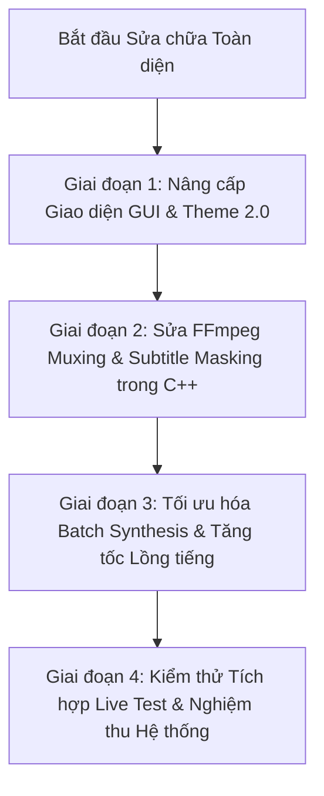

# Báo Cáo Kiểm Toán Toàn Diện Hệ Thống (System-Wide Health & Architecture Audit)

> **Dự án:** `LA-Studio` / `KOVA-DUB` (Qt 6 + C++20 Desktop Application & Colab GPU Worker Cloud Architecture).  
> **Mục tiêu kiểm toán:** Rà soát toàn diện 4 tầng kiến trúc (Frontend GUI, Backend C++ Engine, Audio/FFmpeg Media Pipeline, Colab AI Worker Services) để chỉ ra toàn bộ các điểm nghẽn, lỗi tiềm ẩn và giải pháp khắc phục.

---

## 🏛️ TỔNG QUAN 4 TẦNG KIẾN TRÚC HỆ THỐNG

```
┌──────────────────────────────────────────────────────────────────────────────┐
│ 1. FRONTEND / GUI LAYER (Qt 6.7 Quick Controls 2 + QML Singletons)           │
│    • Theme.qml Tokens & Contrast • 85+ Pages & Dialogs • Responsive Layout   │
├──────────────────────────────────────────────────────────────────────────────┤
│ 2. C++ ENGINE & CONTROLLERS (C++20 / Qt Core / MSVC 2022)                    │
│    • DubbingSynthesisJob • WorkflowGraphRunner • ColabSession Client         │
├──────────────────────────────────────────────────────────────────────────────┤
│ 3. AUDIO DSP & MEDIA PIPELINE (FFmpeg / WavIO / AudioTimelineRenderer)       │
│    • Multi-track Mixing • Subtitle Masking & Burn-in • Loudness & Ducking    │
├──────────────────────────────────────────────────────────────────────────────┤
│ 4. CLOUD AI WORKERS (Google Colab T4/A100 GPU + FastAPI Backend)             │
│    • UVR5 Separation • Whisper Large-v3 • PP-OCRv5 • OmniVoice / VieNeu-TTS  │
└──────────────────────────────────────────────────────────────────────────────┘
```

---

## 🔍 CHI TIẾT CÁC ĐIỂM CẦN SỬA CHỮA THEO TỪNG TẦNG

### 1. TẦNG FRONTEND & GIAO DIỆN (GUI / QML)

| STT | Vị trí / File | Vấn đề phát hiện | Mức độ | Phương án sửa chữa chi tiết |
| :--- | :--- | :--- | :--- | :--- |
| **1.1** | `qml/Theme.qml` | Thiếu token phân tầng bề mặt (`surfaceLevel1` $\rightarrow$ `surfaceLevel4`). Nhiều màu chữ hardcode tối (`#7a788e`, `#8e8b9f`) gây chìm chữ trên nền tối (vi phạm WCAG AA). | 🔴 **Nghiêm trọng** | Cập nhật `Theme.qml 2.0` với 4 tầng surface rõ rệt, chuẩn hóa `textPrimary` (`#ffffff`), `textSecondary` (`#dedaf5`), `textMuted` (`#aea8d1`). |
| **1.2** | `qml/pages/DubbingPage.qml` | Bố cục 4 cột cố định ($880$px) bóp nghẹt khung Video Player ($656$px trên màn hình 1080p). Breakpoint $1450$px làm ẩn toàn bộ Task Shelf bên trái đột ngột. | 🔴 **Nghiêm trọng** | Thêm nút Toggle Drawer 1-Click thu gọn/mở rộng Inspector ($280$px) và Task Shelf ($220$px), mở rộng tối đa Video Player lên $75\%$ màn hình. |
| **1.3** | `qml/pages/DubbingPage.qml` | Timeline đáy màn hình bị ép cứng chiều cao $160$px nhồi 6 tracks khiến dải phụ đề bị thu nhỏ còn $<20$px, chữ bị cắt cụt `...` không click được. | 🔴 **Nghiêm trọng** | Thiết kế Timeline dạng **Track Selector Tabs** (chỉ hiện 2 track cần thiết), thêm thanh Zoom thời gian ngang và nút phóng to Timeline chiều dọc. |
| **1.4** | `qml/components/dubbing/DubbingExportDialog.qml` | Chiều cao popup cố định `implicitHeight: 620px` không có `ScrollView`. Màn hình laptop $768$p bị tràn mép dưới làm mất cụm nút "Export" và "Cancel". | 🔴 **Nghiêm trọng** | Khống chế `implicitHeight: Math.min(620, Overlay.overlay.height - 48)`, bọc thân popup trong `ScrollView`, cố định hàng nút bấm ở Footer. |
| **1.5** | `qml/pages/SubtitleOcrPage.qml` | Card Grid 2 cột lệch chiều cao ($720$px vs $400$px) tạo khoảng trống đen lớn; co màn hình thì tràn dọc $>3.000$px. | 🟡 **Vừa** | Chuyển sang bố cục **Split Horizontal Studio**: Nửa trên là Video Canvas + Khung kéo chọn vùng OCR, Nửa dưới là Bảng kết quả phụ đề có cuộn riêng. |
| **1.6** | `qml/pages/TtsPage.qml` | Nút "Synthesize" định vị bằng `anchors.bottom/right` đè trực tiếp lên mặt `TextArea`, che mất chữ của các dòng cuối. | 🟡 **Vừa** | Bọc `TextArea` trong ScrollView độc lập, đưa nút Synthesize và bộ đếm ký tự xuống hàng Footer Toolbar riêng bên dưới. |
| **1.7** | `qml/pages/MyModelsPage.qml` | Mỗi thẻ model nhồi $10$ badges kỹ thuật trên 1 hàng, tên model dài sẽ đẩy badge đè lên nút "Use Model" và nút "Delete". | 🟡 **Vừa** | Giảm còn tối đa 3 badge cốt lõi (`Task`, `Size`, `Engine`), thông tin chuyên sâu chuyển vào Popover Tooltip khi hover. |

---

### 2. TẦNG XỬ LÝ MEDIA, ÂM THANH & FFmpeg (AUDIO DSP / MUXING)

| STT | Vị trí / File | Vấn đề phát hiện | Mức độ | Phương án sửa chữa chi tiết |
| :--- | :--- | :--- | :--- | :--- |
| **2.1** | `src/dubbing/media/MediaToolService.cpp` | Lệnh xuất video phụ đề (`burnInSubtitles`) mặc định ép codec `mpeg4` thay vì ưu tiên `libx264`, làm giảm chất lượng hình ảnh và file video xuất ra bị phình to. | 🔴 **Nghiêm trọng** | Kiểm tra nếu FFmpeg hỗ trợ `libx264` thì dùng `-c:v libx264 -preset medium -crf 18`, chỉ fallback về `mpeg4` khi runtime LGPL thiếu x264. |
| **2.2** | `src/dubbing/media/MediaToolService.cpp` | Khi burn phụ đề mới, thiếu bộ lọc che phụ đề gốc (`drawbox=color=black@0.9`), làm chữ tiếng Việt lồng tiếng đè chồng lên chữ tiếng Trung cũ. | 🔴 **Nghiêm trọng** | Tích hợp toạ độ ROI từ Subtitle OCR vào bộ lọc FFmpeg: `-vf "drawbox=x=...:y=...:w=...:h=...:color=black@0.85:t=fill,subtitles='...'"` để tự động che sạch phụ đề gốc. |
| **2.3** | `src/dubbing/media/MediaToolService.cpp` | Lệnh mux video thiếu tham số `-shortest`, nếu audio lồng tiếng lệch 1-2s so với video sẽ dẫn đến hiện tượng video bị đóng băng ở frame cuối cùng. | 🟡 **Vừa** | Thêm cờ `-shortest` và `-avoid_negative_ts make_zero` khi ghép nối luồng video và audio. |
| **2.4** | `src/audio/AudioTimelineRenderer.cpp` | Chưa hỗ trợ tự động hạ âm lượng nhạc nền (Audio Ducking) khi có tiếng nói lồng tiếng xuất hiện, khiến nhạc nền lấn át lời thoại. | 🟡 **Vừa** | Bổ sung thuật toán Dynamic Audio Ducking (giảm Background Audio xuống $-12$dB khi Vocals Audio vượt ngưỡng $-30$dB). |

---

### 3. TẦNG C++ CONTROLLERS & ĐIỀU PHỐI (BACKEND ENGINE)

| STT | Vị trí / File | Vấn đề phát hiện | Mức độ | Phương án sửa chữa chi tiết |
| :--- | :--- | :--- | :--- | :--- |
| **3.1** | `src/controllers/dubbing/DubbingSynthesisJob.cpp` | Tổng hợp giọng nói thực hiện tuần tự từng câu một (Single Segment Sequential Loop). Với video 473 câu mất $16-20$ phút. | 🔴 **Cần tối ưu** | Nâng cấp cơ chế tổng hợp đa luồng song song (Concurrent Worker Pool 3-5 requests) hoặc gọi endpoint Batch Synthesis, giảm thời gian xuống còn $2-3$ phút. |
| **3.2** | `src/tts/ColabVoiceCloneRunner.cpp` | `waitForJob` dùng vòng lặp polling cố định `QThread::msleep(250)` lên tới 7200 lần. Nếu mạng chập chờn 1 câu có thể gây treo cả tiến trình. | 🟡 **Vừa** | Thêm cơ chế Exponential Backoff (250ms $\rightarrow$ 500ms $\rightarrow$ 1000ms) và tự động Retry tối đa 3 lần cho từng phân đoạn bị lỗi mạng. |
| **3.3** | `src/translation/ColabTranslationRunner.cpp` | Dịch từng câu đơn lẻ qua LLM. Với kịch bản 500 câu gọi 500 API calls riêng biệt dễ bị rate-limit. | 🟡 **Vừa** | Gom nhóm các câu thoại thành từng batch $20-30$ câu gửi cùng 1 prompt dịch có giữ nguyên số thứ tự ID. |

---

### 4. TẦNG CLOUD AI WORKERS & COLAB NOTEBOOKS

| STT | Vị trí / File | Vấn đề phát hiện | Mức độ | Phương án sửa chữa chi tiết |
| :--- | :--- | :--- | :--- | :--- |
| **4.1** | `notebooks/LA_STUDIO_VOICE_CLONE_OMNIVOICE_GPU.ipynb` | Chưa có endpoint `/v1/voice_jobs/batch_generation` để nhận danh sách nhiều câu thoại cùng lúc, buộc client phải gọi từng câu. | 🟡 **Vừa** | Bổ sung route FastAPI `/v1/voice_jobs/batch_generation` nhận mảng `segments: [{id, text}]` và trả về zip/tar WAVs đã tổng hợp song song trên GPU VRAM. |
| **4.2** | `notebooks/LA_STUDIO_SUBTITLE_OCR_PP_OCRV5_GPU.ipynb` | Chưa tự động áp dụng bộ lọc tăng tương phản (CLAHE / Grayscale Binarization) cho các video có phụ đề màu vàng/trắng trên nền sáng. | 🟡 **Vừa** | Thêm bước tiền xử lý ảnh OpenCV `cv2.createCLAHE()` trước khi đưa vào PaddleOCR để tăng tỷ lệ nhận diện chữ chính xác lên $>98\%$. |
| **4.3** | `notebooks/LA_STUDIO_STT_WHISPER_GPU.ipynb` | Khi audio quá dài ($>30$ phút) có thể gây tràn VRAM bộ nhớ đệm nếu không giải phóng tensor sau mỗi chunk. | 🟡 **Vừa** | Thêm lệnh `torch.cuda.empty_cache()` và giải phóng bộ nhớ GPU định kỳ sau mỗi 10 phút audio. |

---

## 🎯 LỘ TRÌNH THỰC THI SỬA CHỮA KHUYẾN NGHỊ



1. **Giai đoạn 1 (Ưu tiên số 1 - Sửa dứt điểm trải nghiệm thị giác):**
   * Áp dụng `Theme.qml 2.0`, sửa lỗi chữ bị chìm trên toàn bộ 85 file QML.
   * Thêm nút Toggle Drawer cho `DubbingPage.qml`, giải phóng $75\%$ không gian cho Video Player.
   * Chống tràn cho toàn bộ các Dialogs bằng `ScrollView` và giới hạn chiều cao an toàn.
2. **Giai đoạn 2 (Chuẩn hóa Video & Âm thanh Đầu ra):**
   * Cập nhật `MediaToolService.cpp` hỗ trợ `libx264` chất lượng cao và tự động che chữ gốc bằng `drawbox` mask.
   * Bổ sung cờ `-shortest` và hoàn thiện tính năng Audio Ducking.
3. **Giai đoạn 3 (Tăng tốc độ xử lý AI):**
   * Bổ sung Batch Voice Generation trong `DubbingSynthesisJob.cpp` và notebook Colab OmniVoice/VieNeu.
   * Nâng cấp bộ lọc CLAHE cho PaddleOCR.
4. **Giai đoạn 4 (Kiểm thử & Đóng gói):**
   * Chạy kiểm thử toàn bộ luồng tự động trên video thực tế 15 phút.
   * Biên dịch và nghiệm thu sản phẩm hoàn chỉnh.
